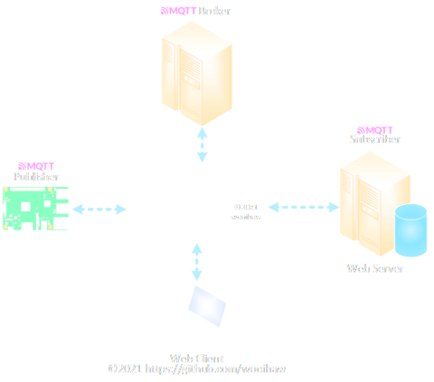
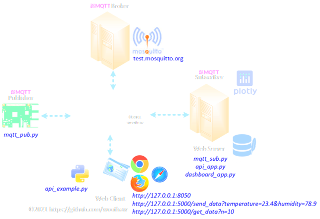
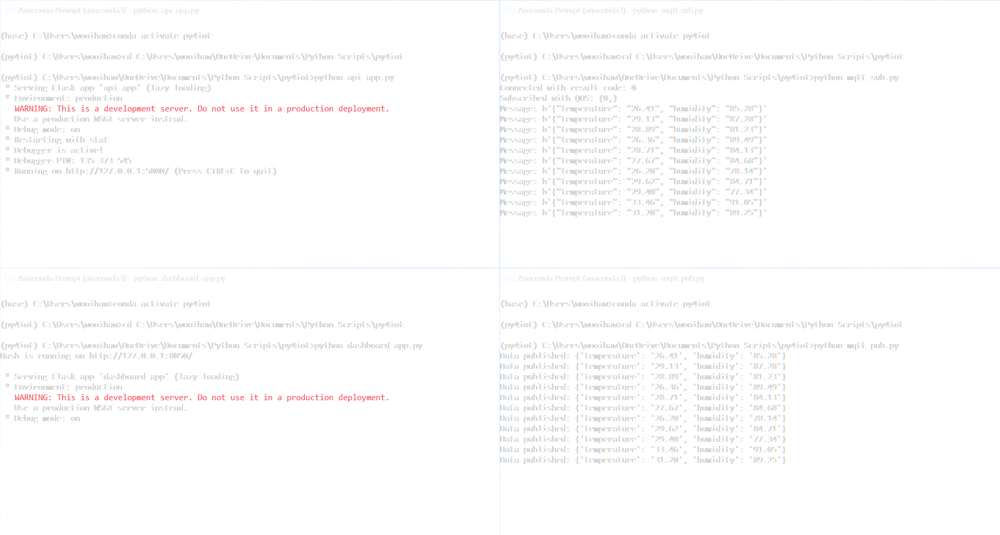
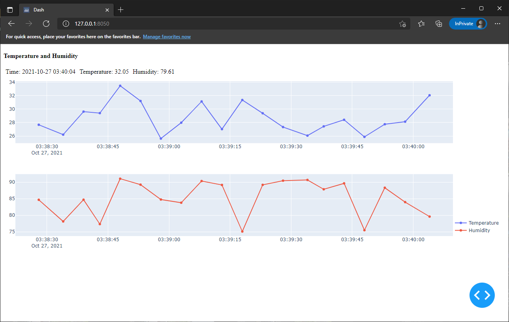

- [1. IMPORTANT](#1-important)
- [2. Introduction](#2-introduction)
- [3. Preparing to run the sample codes](#3-preparing-to-run-the-sample-codes)
  - [3.1. Create virtual environment with Conda](#31-create-virtual-environment-with-conda)
  - [3.2. Create virtual environment with Python venv](#32-create-virtual-environment-with-python-venv)
  - [3.3. Install only the required Python modules and packages](#33-install-only-the-required-python-modules-and-packages)
- [4. Description of Sample Codes](#4-description-of-sample-codes)
- [5. Steps to run the Python scripts](#5-steps-to-run-the-python-scripts)
- [6. Screenshots](#6-screenshots)

# 1. IMPORTANT
The materials in this [repository](https://github.com/wooihaw/py4iot) (https://github.com/wooihaw/py4iot) are meant for proof-of-concept (POC) only and they must not be used for production or deployment.

# 2. Introduction
1. This project simulates a typical IoT system with an IoT device, MQTT broker, web server and web client, as shown in the following figure.

2. The IoT device publishes a set of sensory data (temperature and humidity) to the MQTT broker (test.mosquitto.org).
3. The web server receives the sensory data via subscription from the MQTT broker and stores the data in the database.
4. The web server is also running web services that allow the web client to send data to and retrieve data from the database.
5. In addition, the web server is hosting an IoT dashboard that plots the sensory data on graphs in real time.
6. The web client can send data to and receive data from the database on the web server via RESTful API.

# 3. Preparing to run the sample codes
1. Clone this repository or download the repository as a zip file.
2. If the repository is downloaded as a zip file, extract the zip file into its own folder.
3. Follow one of the methods below to create a virtual environment.

## 3.1. Create virtual environment with Conda
1. Follow this method if you have installed Anaconda.
2. Launch Anaconda Prompt.
3. Create a cirtual environment called py4iot with Python 3.9:
   - conda create -n py4iot python=3.9
4. After the virtual environment is created, activate it:
   - conda activate py4iot
5. Change to the folder with the extracted repository.
6. Install the required Python modules and packages:
   - python -m pip install -r requirements.txt
7. To deactivate the virtual environment:
   - conda deactivate

## 3.2. Create virtual environment with Python venv
1. Launch a terminal/command prompt.
2. Change to the folder with the extracted repository.
3. Create a virtual environment:
    - python -m venv env
4. Once the virtual environment has been created, there will be a folder called "env" in the current folder.
5. To activate the virtual environment in Windows:
   - cd env\Scripts
   - activate
   - cd ..\\..
6. To active the virtual environment in Linux:
   - souce env/bin/activate
7. Install the required Python modules and packages:
   - python -m pip install -r requirements.txt
8. To deactive the virtual environment in Windows or Linux:
   - deactivate

## 3.3. Install only the required Python modules and packages
1. Follow this method if you do not wish to create a virtual environment.
2. Launch a terminal/command prompt.
3. Install the required Python modules and packages:
   - python -m pip install requests paho-mqtt dash

# 4. Description of Sample Codes
1. The following table lists the Python scripts in this repository and describes their roles.

| Filename         | Description                                         |
| :--------------- | :-------------------------------------------------- |
| api_app.py       | Python script for RESTful API (server)              |
| api_example.py   | Python script on accessing the RESTful API (client) |
| dashboard_app.py | Python script for the dashboard (server)            |
| mqtt_pub.py      | Python script for MQTT publisher                    |
| mqtt_sub.py      | Python script for MQTT subscriber                   |
| sql_func.py      | Python module with helper functions for SQLite      |

2. The figure below shows the role of each Python script diagrammatically.

3. In this project, the local machine (the computer on which the Python scripts are running) simulates the roles of the IoT device, the web server and the web client.

# 5. Steps to run the Python scripts
1. Launch four terminal/command prompt/Anaconda prompt.
2. One each terminal/command prompt/Anaconda prompt, change to the folder with the extracted repository and activate the virtual environment (if virtual environment was created).
3. Enter one of commands below to run a Python script in each terminal/command prompt/Anaconda prompt:
   * python api_app.py
   * python dashboard_app.py
   * python mqtt_sub.py
   * python mqtt_pub.py

# 6. Screenshots
1. Running Python scripts in Anaconda Prompt.

2. Viewing Iot dashboard on Edge browser.

